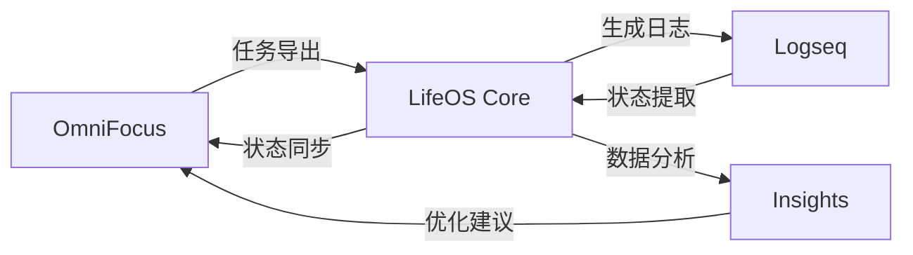

# LifeOS - Personal Life Operating System

> 整合 GTD 任务管理与智能日志记录的个人生产力系统

[](https://opensource.org/licenses/MIT)
[]()
[]()

## 🎯 项目简介

LifeOS 是一个自动化的个人生产力系统，专为知识工作者设计。它无缝集成了 **OmniFocus**（GTD任务管理）和 **Logseq**（结构化日志记录），实现了从任务规划到执行反思的完整闭环。

### 核心特性

- 🔄 **双向自动同步** - OmniFocus ↔ Logseq 任务状态实时同步
- 📝 **智能日志生成** - 自动生成结构化的每日工作日志
- 🎯 **意图驱动工作法** - 不只管理"做什么"，更关注"为什么做"
- 🧠 **学习闭环** - 自动捕获和整理工作中的知识与洞察
- 📊 **数据驱动优化** - 基于执行数据持续优化个人工作模式
- ⚡ **无感知自动化** - 每日仅需5-10分钟手动操作

### 解决的问题

传统的任务管理工具只关注"做什么"，而忽略了：
- **执行过程** - 如何思考和决策的？
- **学习收获** - 从任务中学到了什么？
- **模式识别** - 什么时候效率最高？
- **意图对齐** - 任务与长期目标的关系？

LifeOS 通过自动化的方式捕获这些"元信息"，让个人生产力管理从简单的任务清单进化为智能的成长系统。

## 📋 系统要求

- **操作系统**: macOS 10.15+
- **必需软件**: 
  - [OmniFocus 3](https://www.omnigroup.com/omnifocus/) - 任务管理
  - [Logseq](https://logseq.com/) - 知识管理和日志
  - Python 3.7+ (通常macOS自带)
- **推荐硬件**: 16GB+ RAM (处理大量笔记数据时)

## 🚀 快速开始

### 一键安装

```bash
# 1. 克隆仓库
git clone https://github.com/huangf06/lifeos.git
cd lifeos

# 2. 运行安装脚本
chmod +x install.sh
./install.sh

# 3. 首次同步
lifeos sync morning
```

### 5分钟体验

1. **准备工作** - 确保 OmniFocus 中有几个测试任务
2. **导入任务** - 运行 `lifeos sync morning`
3. **查看结果** - 打开 Logseq，查看自动生成的今日页面
4. **记录执行** - 在工作时简单记录想法和进展
5. **同步状态** - 晚上运行 `lifeos sync evening`

## 📖 使用指南

### 每日工作流程

#### 🌅 晨间（3-5分钟）
系统自动完成：
- 从 OmniFocus 导出今日任务
- 生成结构化的 Logseq 日志页面  
- 按优先级分组任务并规划时间块

用户只需：
- 填写今日意图和价值观实践
- 确认任务优先级和时间安排

#### 📝 日间（随时记录）
在工作过程中随时记录：
```markdown
### 10:30 - 重要洞察
> 发现了更好的架构设计方案，可以减少30%的复杂度

@decision: 是否重构现有代码 → 选择渐进式重构 → 因为风险可控且长期收益明显
```

#### 🌙 晚间（5-10分钟）
系统自动完成：
- 提取任务完成状态同步回 OmniFocus
- 将执行记录添加到 OmniFocus 任务备注
- 生成当日数据统计

用户只需：
- 完成晚间反思（成就、挑战、明日重点）
- 评估今日满意度和成长收获

### 核心概念

#### 意图驱动的任务管理
传统任务管理：
```
- [ ] 完成项目报告
```

LifeOS 任务管理：
```markdown
- [ ] 完成项目报告 `[重要项目]` @computer ⏱️3h &of:ABC123
  意图: 为团队提供决策依据，展示技术专业度
  价值对齐: 追求卓越、团队协作
  成功标准: 数据准确、逻辑清晰、建议可执行
```

#### 结构化的执行记录
不只记录"做了什么"，更记录"怎么想的"：
```markdown
@decision: {
  问题: "选择技术方案A还是B？"
  考虑因素: ["开发效率", "长期维护", "团队技能"]
  选择: "方案A"
  理由: "虽然复杂但长期收益更大"
  信心度: 8/10
}
```

## 🏗️ 系统架构



### 核心组件

- **同步引擎** - 处理 OmniFocus ↔ Logseq 的双向数据流
- **模板生成器** - 基于任务数据生成智能的日志模板
- **数据处理器** - 分析执行模式，生成洞察报告
- **自动化调度** - 处理定时任务和系统通知

## 📊 功能特性

### ✅ 已实现功能

- [x] OmniFocus 任务自动导出（包含项目、上下文、时间估算）
- [x] Logseq 智能日志生成（意图设定、时间规划、执行记录）
- [x] 双向状态同步（完成、延期、取消状态）
- [x] 执行记录回传（质量评分、关键洞察自动添加到OmniFocus备注）
- [x] 自动化定时任务（晨间8:00、晚间21:00）
- [x] 系统通知和错误处理
- [x] 完整的日志记录和状态监控

### 🚧 开发中功能

- [ ] 生产力数据分析和可视化
- [ ] AI辅助的任务优先级优化
- [ ] 健身和学习数据集成
- [ ] Web界面管理控制台
- [ ] 团队协作功能扩展

### 💡 计划功能

- [ ] 支持更多GTD工具（Things、Todoist）
- [ ] 支持更多笔记工具（Obsidian、Notion）
- [ ] 移动端应用
- [ ] 云端数据同步（可选）

## 🤝 贡献指南

我们欢迎各种形式的贡献！

### 如何贡献

1. **Fork** 本仓库
2. **创建**特性分支 (`git checkout -b feature/amazing-feature`)
3. **提交**你的改动 (`git commit -m 'Add amazing feature'`)
4. **推送**到分支 (`git push origin feature/amazing-feature`)
5. **创建** Pull Request

### 贡献类型

- 🐛 **Bug修复** - 发现并修复问题
- ✨ **新功能** - 添加有用的新特性
- 📝 **文档改进** - 完善使用指南和API文档
- 🎨 **用户体验** - 优化界面和交互流程
- 🧪 **测试用例** - 增加自动化测试覆盖
- 🌍 **本地化** - 支持更多语言

## 📄 许可证

本项目基于 [MIT License](LICENSE) 开源。

## 🙏 致谢

- [OmniGroup](https://www.omnigroup.com/) - 提供了优秀的任务管理工具
- [Logseq](https://logseq.com/) - 提供了开放的知识管理平台  
- 所有贡献者和用户的反馈和建议

## 📞 支持与反馈

- **Issues** - [GitHub Issues](https://github.com/your-username/lifeos/issues)
- **讨论** - [GitHub Discussions](https://github.com/your-username/lifeos/discussions)
- **文档** - [Wiki](https://github.com/your-username/lifeos/wiki)

---

**LifeOS - 让生活更有序，让成长更可见** 🌟

*如果这个项目对你有帮助，请给它一个 ⭐️！*
