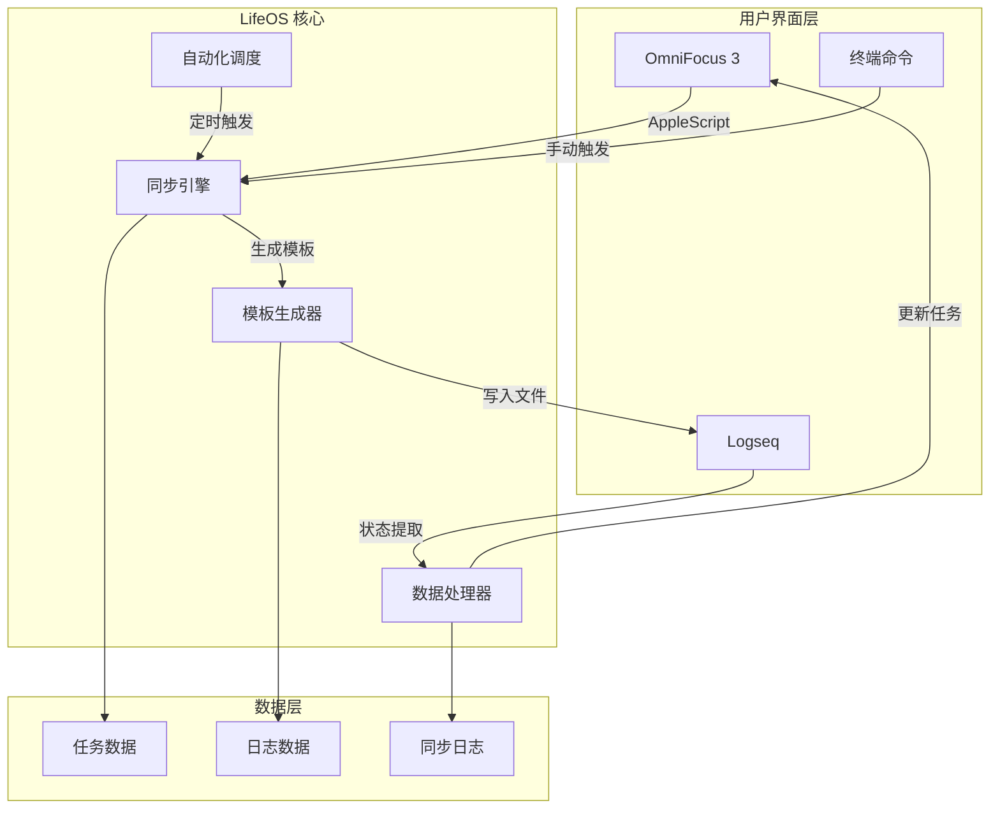

# LifeOS 系统架构

## 🏗️ 整体架构



## 🔧 核心组件

### 1. 同步引擎 (Sync Engine)
负责 OmniFocus ↔ Logseq 双向数据同步

**职责：**
- 从 OmniFocus 导出任务数据
- 解析 Logseq 中的状态更新
- 处理数据转换和映射
- 错误处理和重试机制

**关键文件：**
- `scripts/lifeos_sync.py` - 核心同步逻辑
- `scripts/omnifocus_export.scpt` - OmniFocus数据导出

### 2. 模板生成器 (Template Generator)  
基于任务数据生成智能的日志模板

**功能：**
- 任务分组和优先级排序
- 智能时间块规划
- 个性化模板定制
- 元数据保留和映射

### 3. 数据处理器 (Data Processor)
分析和处理日志中的执行数据

**功能：**
- 状态变更识别
- 执行记录提取
- 质量评分解析
- 洞察内容整理

### 4. 自动化调度 (Automation Scheduler)
管理定时任务和系统集成

**功能：**
- LaunchAgent 定时任务
- 系统通知发送
- 错误日志记录
- 应用自动启动

## 📊 数据流设计

### 晨间同步流程
```
OmniFocus任务 → AppleScript导出 → JSON数据 → Python处理 → 
模板生成 → Logseq文件写入 → 用户通知 → 应用启动
```

### 晚间同步流程
```
Logseq文件 → 内容解析 → 状态提取 → 数据映射 → 
AppleScript更新 → OmniFocus状态同步 → 备注更新 → 日志记录
```

## 🔄 扩展架构

系统设计支持未来扩展：

### 适配器模式
```python
class BaseAdapter(ABC):
    @abstractmethod
    def export_tasks(self) -> List[Task]: pass
    
    @abstractmethod  
    def update_task_status(self, task_id: str, status: str): pass

class OmniFocusAdapter(BaseAdapter):
    # OmniFocus 具体实现
    
class ThingsAdapter(BaseAdapter):
    # Things 3 具体实现
```

### 插件系统
- 健身数据集成插件
- 学习进度追踪插件  
- 财务数据同步插件
- AI分析和建议插件